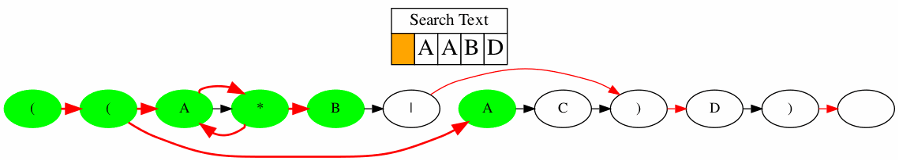

# Regex-Engine

This is a regular expression engine that functions by converting a regular expression to a Nondeterministic Finite State Automata (NFA). The primary purpose of this project is to educate by showing the inner workings of a regular expression engine. This is done in two ways:

1. A regular expression can be transformed into an NFA and displayed visually
2. The NFA can operate on a body of text, demonstrating the process for how an NFA matches text.

  

I wrote an article on Medium with a thorough explanation of how the algorithm functions. You can find that [here](https://medium.com/p/e0df447b827a).

# Setup
There are two distinct scripts you may want to use: re_to_nfa.py and re_to_nfa_viz.py. The former converts regular expressions to NFAs and can search text, while the latter does the same but animates the process.

To create the Graphviz animations, you'll need to install it as a Python library (pip install graphviz) and [directly onto your computer](https://www.graphviz.org/download/). 

Instructions on how to run the scripts are found in their main functions.

Note that the code for re_to_nfa.py is much cleaner than the visualization script. I had to do some terrible things to get Graphviz to format everything how I wanted it.

# References
I modeled the RE engine after the one presented in Sedgewick and Wayne's [online course](https://www.coursera.org/learn/algorithms-part2) and [textbook](https://algs4.cs.princeton.edu/home/). In fact, the example regex and text in the gif above are taken directly from the excellent NFA Simulation lecture. 

[This article](https://swtch.com/~rsc/regexp/regexp1.html) by Russ Cox also gave a helpful explanation of the regex NFA, and the advantages it has against other approaches. 

Lastly wanted to shout out the [Graphviz forums](https://forum.graphviz.org/) which were instrumental in getting the visualization to work.
